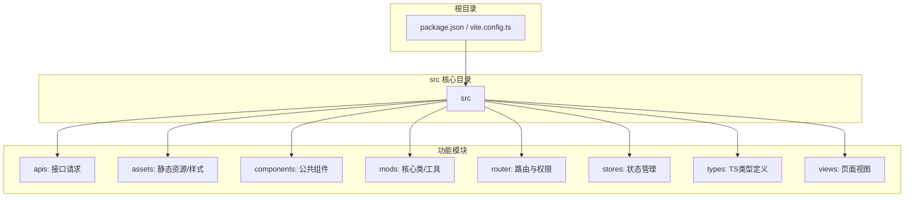

# 前端项目概述

## 目录
1. [简介](#简介)
2. [项目结构](#项目结构)
3. [技术栈与依赖](#技术栈与依赖)
4. [核心功能模块](#核心功能模块)
5. [架构与渲染机制](#架构与渲染机制)
6. [状态与路由管理](#状态与路由管理)

## 简介

交通仿真系统前端项目（traffic_sim_frontend）是一个基于 Vue 3 + Vite + TypeScript 构建的高性能单页面应用（SPA）。该项目旨在为用户提供直观、流畅的交通仿真任务配置、实时运行监控以及历史数据回放的可视化界面。

系统采用了现代化的前端技术栈，通过 Element Plus 提供统一的 UI 交互体验，并结合高性能的 2D WebGL 渲染引擎 Pixi.js，实现了对海量仿真元素（如车辆、信号灯相位、路网结构）的流畅绘制与交互。项目结构清晰，按业务功能和技术职责划分为多个模块，便于扩展和维护。

## 项目结构

项目采用标准的 Vite + Vue 3 目录结构，主要业务代码集中在 `src` 目录下：

## 技术栈与依赖

- **核心框架**: Vue 3 (Composition API, `<script setup>`)
- **构建工具**: Vite (极速的冷启动和 HMR)
- **开发语言**: TypeScript (提供强类型检查，提升代码质量)
- **UI 组件库**: Element Plus (按需引入，配合 AutoImport 和 Components 插件)
- **状态管理**: Pinia (轻量、直观的全局状态管理)
- **路由管理**: Vue Router 4 (支持动态路由和导航守卫)
- **图形渲染**: Pixi.js (核心仿真渲染引擎，替代传统 Canvas 以提升性能)
- **图表可视化**: ECharts (用于统计数据的图表展示)
- **网络请求**: Axios (封装了统一的请求头和错误处理拦截器)
- **实时通信**: WebSocket / Server-Sent Events (SSE) (用于接收后端实时仿真数据流)

## 核心功能模块

系统前端主要包含以下几个核心业务模块：

1.  **用户与权限系统**: 提供登录、注册、个人中心功能。通过 JWT Token 结合 Vue Router 导航守卫实现页面访问控制，并根据用户角色（如管理员）动态控制菜单显示（如用户管理、全局设置）。
2.  **地图管理**: 支持用户上传（txt/xml/osm）、预览、删除交通路网地图。系统能自动将上传的地图转换为 JSON 格式，并生成路网缩略图。
3.  **仿真向导 (`PISteps`)**: 提供四步创建仿真的引导流程：设置名称 -> 选择/上传路网 -> 配置交通流(OD)和信号灯周期 -> 配置接管插件。
4.  **实时仿真与监控 (`SimPIView`)**: 核心视图之一。通过 WebSocket 连接后端仿真引擎，实时接收并渲染车辆位置、速度、路口信号灯状态等，并展示实时统计数据。
5.  **仿真记录与回放 (`SimRecordView` & `SimReplayView`)**: 管理历史仿真任务记录。回放视图通过 SSE (Server-Sent Events) 或 API 拉取历史数据，利用 Pixi.js 重现仿真过程，支持播放、暂停、进度条跳转及倍速控制。

## 架构与渲染机制

前端在渲染交通仿真场景时，经历了一次重要的架构升级：从传统的 HTML5 Canvas (`CanvasRenderingContext2D`) 迁移到了 **Pixi.js** (WebGL 2D 渲染引擎)。

- **背景提取与静态层**: 利用早期的 `sim.js` 工具（基于 Canvas），在前端读取地图 JSON 数据后，计算边界(Bounding Box)并绘制带有路段编号/路口编号的静态路网缩略图（Base64 URL）。
- **动态渲染层 (`SimPIXI.ts`)**: Pixi.js 作为核心渲染引擎。
    - 将静态路网图作为底层的 `PIXI.Sprite`。
    - 在其上方建立坐标系，将后端传来的车辆坐标 (`x`, `y`) 转换为 Pixi.js 容器内的坐标。
    - 使用对象池或精灵数组(`m_vehs`, `m_crosses`) 管理成百上千的车辆和红绿灯。
    - 自动计算车辆的偏转角度（弧度），实现平滑的转向动画。
    - 支持鼠标拖拽路网、滚轮无极缩放，保证大地图下的良好交互体验。

## 状态与路由管理

- **Pinia (`stores/auth.ts`)**: 集中管理用户的登录状态、Token、基本信息和角色。由于其轻量化设计，避免了 Vuex 的繁琐。
- **Vue Router (`router/permission.ts`)**: 实现了细粒度的路由拦截。
    - 检查路由的 `meta.requiresAuth` 属性判断是否需要登录。
    - 检查 `meta.roles` 属性拦截越权访问（如普通用户访问 `/usermanager` 会被重定向）。
    - 结合 Axios 拦截器，当后端返回 `401 Unauthorized` 时，自动清除 Pinia 和 LocalStorage 中的认证信息并跳转至登录页。